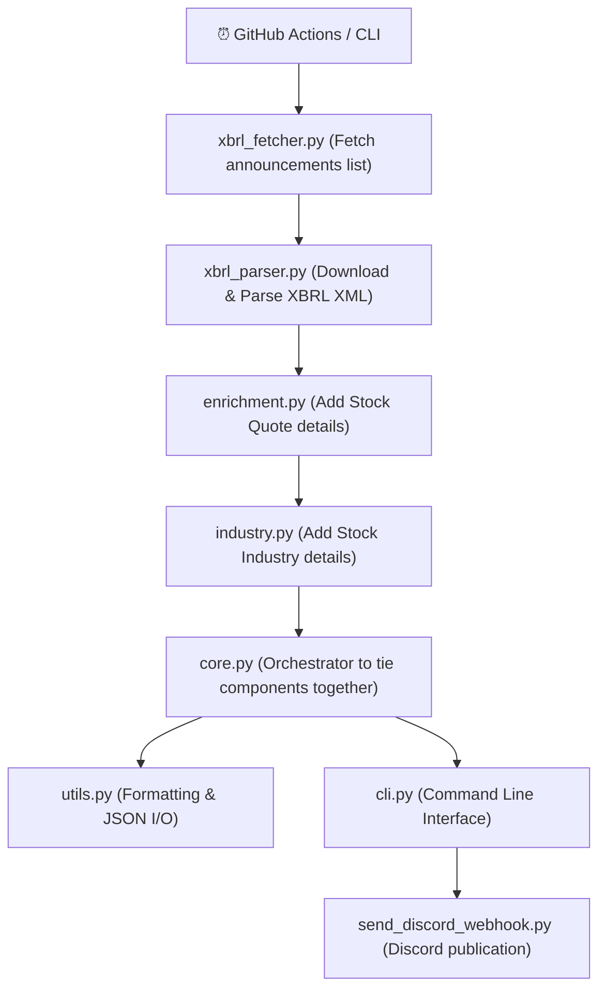

# ARCHITECTURE

## Structure & Data Flow



## Directory Structure
```
indiainc-today/
├── src/
│   └── indiainc_today/
│       ├── __init__.py
│       ├── cli.py
│       ├── config.py
│       ├── core.py
│       ├── enrichment.py
│       ├── industry.py
│       ├── retries.py
│       ├── utils.py
│       ├── xbrl_fetcher.py
│       └── xbrl_parser.py
├── scripts/
│   └── send_discord_webhook.py
└── tests/
```
