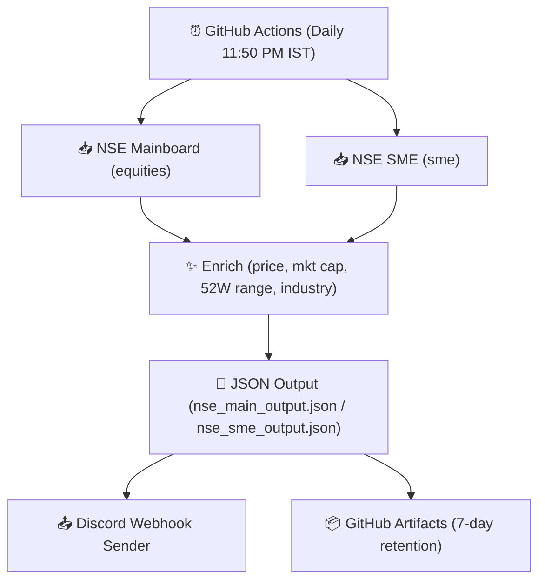

# 📋 IndiaInc Today

Daily digest of key corporate XBRL announcements from the National Stock Exchange (NSE), enriched with real-time market data and industry classifications, delivered directly to Discord.

---

## 🚀 Overview

IndiaInc Today monitors NSE corporate XBRL filings across **8 key announcement categories**:
- **Restructuring (Regulation 30)** (e.g., acquisitions, mergers, slump sales)
- **Issuance of Securities** (e.g., QIPs, preferential allotments)
- **Agreements / Contracts**
- **Orders & Contracts**
- **Fraud / Default**
- **Corporate Debt Restructuring**
- **Insolvency (IBC / CIRP)**
- **One Time Settlement**

The pipeline runs automatically every night, fetching raw XML filings, parsing structured values (numbers, currencies, booleans), enriching them with real-time stock quotes, and publishing visual alerts to Discord.

---

## 🏗️ Architecture



---

## 🛠️ Installation & Setup

Ensure you have [Python 3.12](https://www.python.org/) and [uv](https://github.com/astral-sh/uv) installed.

1. **Clone the repository**:
   ```bash
   git clone <repo-url>
   cd IndiaInc-today
   ```

2. **Sync dependencies**:
   ```bash
   uv sync --all-extras --dev
   ```

3. **Set up Discord Webhook URL (for posting)**:
   On Windows (PowerShell):
   ```powershell
   $env:DISCORD_WEBHOOK_URL="https://discord.com/api/webhooks/..."
   ```
   On Linux/macOS:
   ```bash
   export DISCORD_WEBHOOK_URL="https://discord.com/api/webhooks/..."
   ```

---

## 💻 CLI Usage

The CLI command is registered as `indiainc-today`.

### 1. Generate Daily Digest (Fetch, Parse, Enrich, and Save)
Processes the filings for a specific segment and date, generating a rich JSON output.

- **Run both Mainboard & SME for today**:
  ```bash
  uv run indiainc-today digest
  ```

- **Run Mainboard only**:
  ```bash
  uv run indiainc-today digest --exchange nse-main
  ```

- **Run SME only**:
  ```bash
  uv run indiainc-today digest --exchange nse-sme
  ```

- **Run for a specific historical date**:
  ```bash
  uv run indiainc-today digest --exchange nse-main --date 05-06-2026
  ```

### 2. Fetch Raw Listings (No enrichment or XML parsing)
Dumps raw announcements list directly to standard output as a flat JSON array.
```bash
uv run indiainc-today fetch --exchange nse-main --date 05-06-2026
```

### 3. Send Digest to Discord
Takes the generated output JSON and publishes formatting-rich embeds to Discord:
```bash
uv run python scripts/send_discord_webhook.py nse_main_output.json --exchange "NSE Mainboard"
```

---

## 📦 Project Structure

```
indiainc-today/
├── src/
│   └── indiainc_today/
│       ├── __init__.py
│       ├── cli.py              # Click CLI definition
│       ├── config.py           # Type mappings, blocklists, and delay configurations
│       ├── core.py             # Orchestrator pipeline
│       ├── enrichment.py       # Quote fetching & symbol-level cache
│       ├── industry.py         # Downloader/cacher for stock-industry-map
│       ├── retries.py          # Tenacity HTTP retry rules
│       └── utils.py            # Currency, spacing, and logging formatters
├── scripts/
│   └── send_discord_webhook.py # Formatter and sender for Discord Webhooks
├── tests/                      # Unit tests (Mocked API layers)
├── .github/workflows/
│   └── daily-digest.yml        # Daily cron workflow (11:50 PM IST)
├── .context/                   # Context documentation
├── pyproject.toml              # Build & dependency settings
└── README.md
```

---

## 🧪 Running Tests & Checks

Before committing code, make sure the unit tests and style linter checks pass:

- **Run Pytest**:
  ```bash
  uv run pytest
  ```

- **Lint checks**:
  ```bash
  uv run ruff check .
  ```

- **Auto-formatting**:
  ```bash
  uv run ruff format .
  ```
